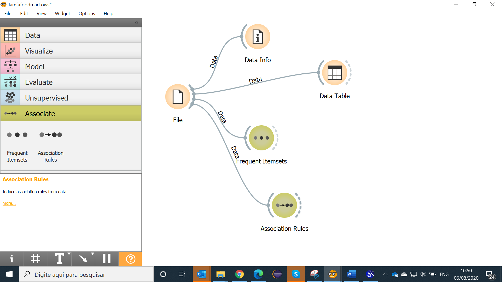
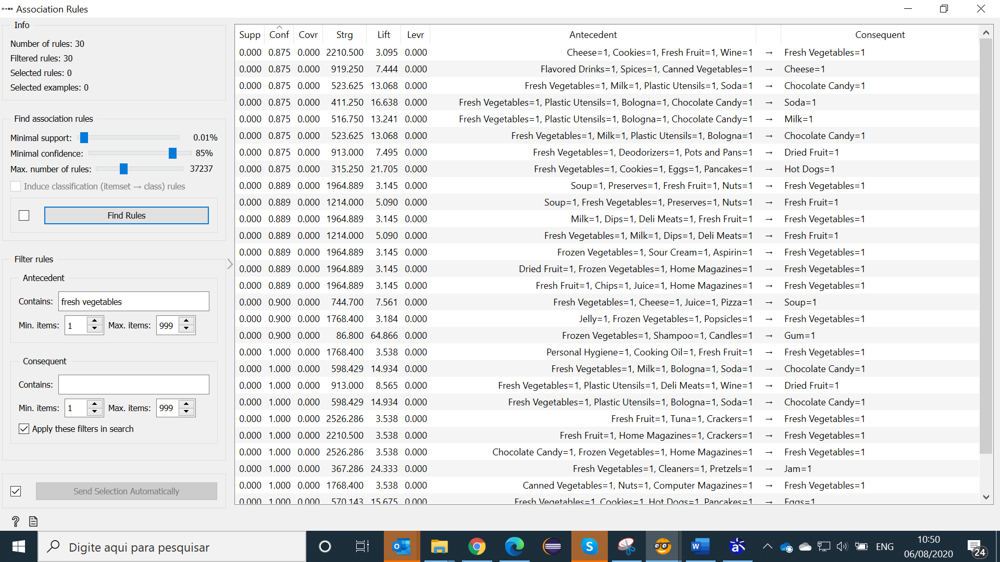
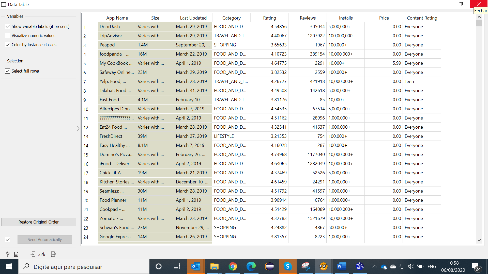
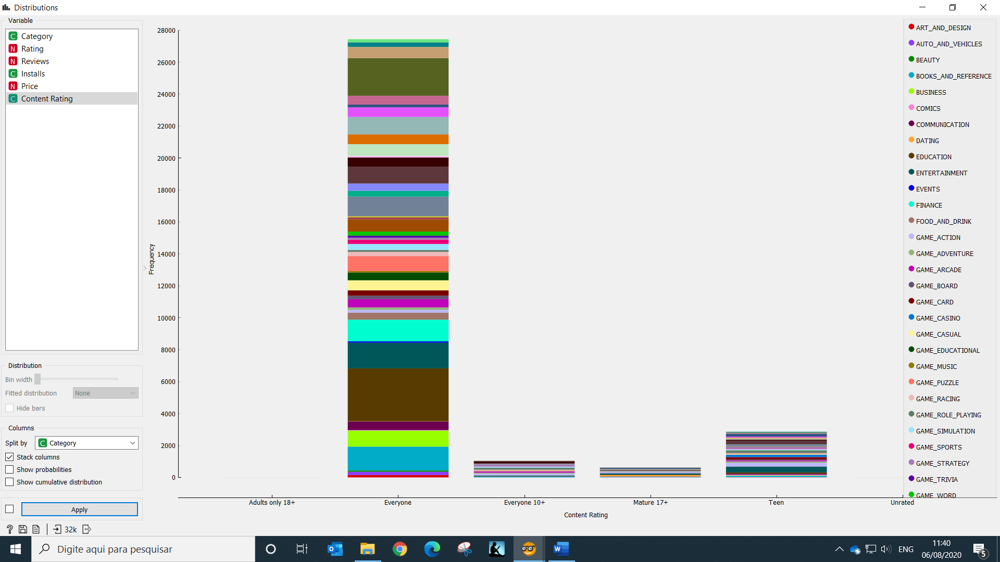
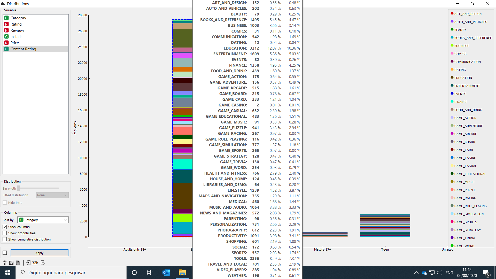
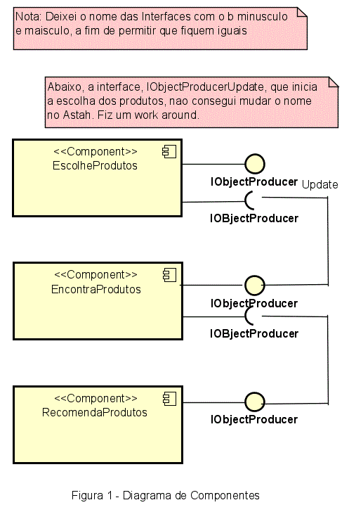

## Lab01 - Data Flow
## ALUNO
   Manoel Teixeira
   
## 1	Tarefa Orange Foodmart
A recomendação que faço é conforme, abaixo, tem vários exemplos produzidos, via tabela, onde podemos pegar os primeiros e agrupar esses produtos numa estante de supermercado, conforme observamos na associação Antecedente/Consequente.
### Imagem do Projeto
  
    
  
 
### Arquivo do Projeto
  [Link para a Tarefa Orange Foodmart](orange/Tarefafoodmart.ows)
 
   
## 2	Tarefa Google Play Store
Analisando, a tabela, a partir do componente, data table, observei que as colunas: “Content Rating” e “Category” de Software seriam interessantes para uma análise. Observamos que a Categoria Educação tem um percentual significativo e é utilizado por todos.
### Imagem do Projeto
  
  
  
  
  
  
  
  
### Arquivo do Projeto
   
 
   
## 3	Tarefa Projeto de Composição para Recomendação
  
   
## 4	Tarefa Projeto de Composição de Pedido
### Diagrama de Componentes
  
 
### Diagrama de Interfaces
  
  --------------------------------------------------------------------- 
