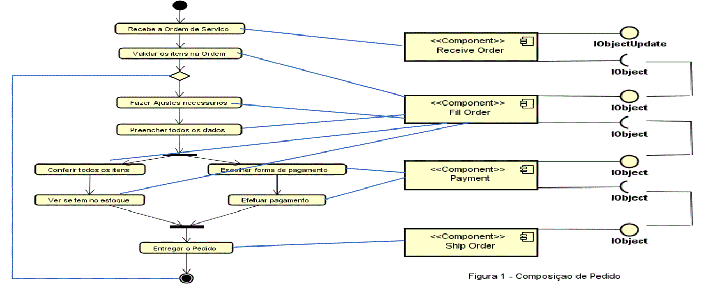
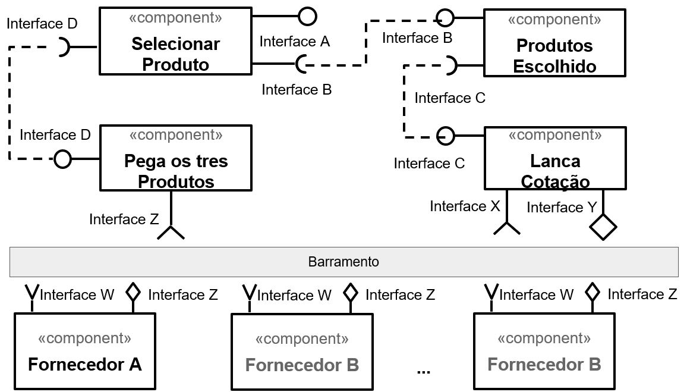
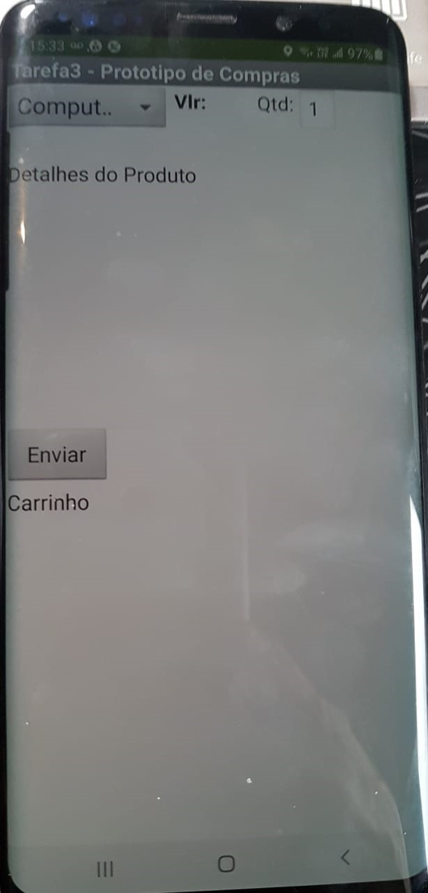
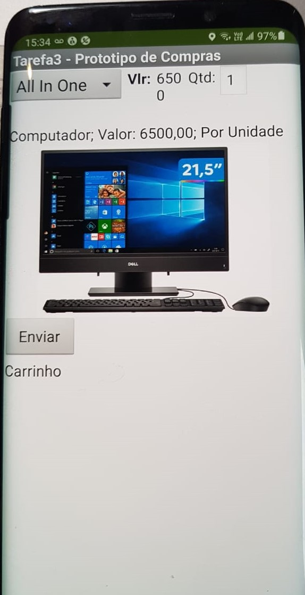
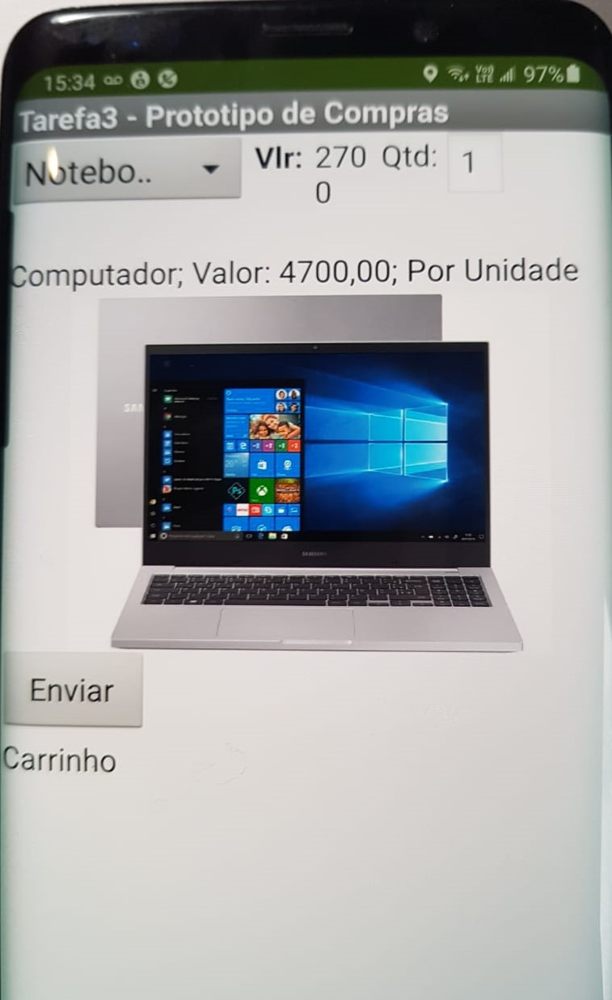

## Lab03 - Model-View-Controller
### Orquestração e Coreografia 
Manoel Teixeira  
## Tarefa 1 - Diagrama de Orquestração

 

## Tarefa 2 - Diagrama de Coreografia
  

Sequencia dos Passos, referente ao Diagrama de Coreografia

 a) Tudo começa pela Interface A, onde através desta o cliente manifesta o seu desejo de adquirir um produto no Marketplace, via o componente selecionar produto; 
 b) A partir da Interface B se busca o produto escolhido, ou seja, que por sua vez será entregue ao componente lança cotação;
 c) Na sequencia, via a interface C, a cotação é lançada no barramento, por evento, onde os fornecedores subscritos, através de categoria de produto, poderão participar desta transação;
 d) Ai, começa, efetivamente a disputa pelos fornecedores, pois cada um deles vai colocar o seu melhor preço naquele produto e retornar no barramento;
 e) Finalmente, a Interface Z, via o componente pega os três melhores preços, ou seja, os menores, a fim de devolver ao cliente, a fim de proceder com a sua escolha. 

## Tarefa 3
Seguem as telas do meu aplicativo "Tarefa 3 - Prototipo de Compras":
 <table border="0"><tr><td>Tela 1  Nenhum produto selecionado </td><td>Tela 2 Primeiro produto selecionado  </td> </tr><tr> <td> Tela 3  Segundo produto selecionado  </td><td> Tela 4  Compra de um dos produtos efetiva Compra de um dos produtos efetiva" src="images/Tela04.jpeg" width="60%" height="35%" /></td><td>  
</td><td>  </td></tr></table>

<b> Diagrama de blocos do aplicativo</b>
   
  
[Baixe aqui o arquivo do aplicativo exportado a partir do MIT App Inventor em formato aia.](app/Inf331Lab03Tarefa3MT.aia) 
   
## Tarefa 4
Imagens da Equipe 4 postadas no endereço [https://github.com/grupo04](https://github.com/grupo04)
