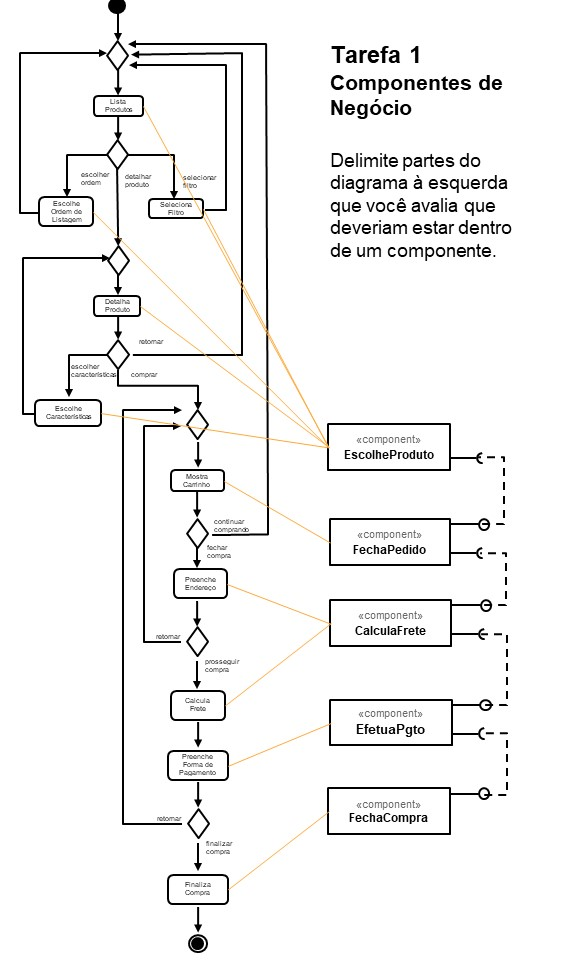
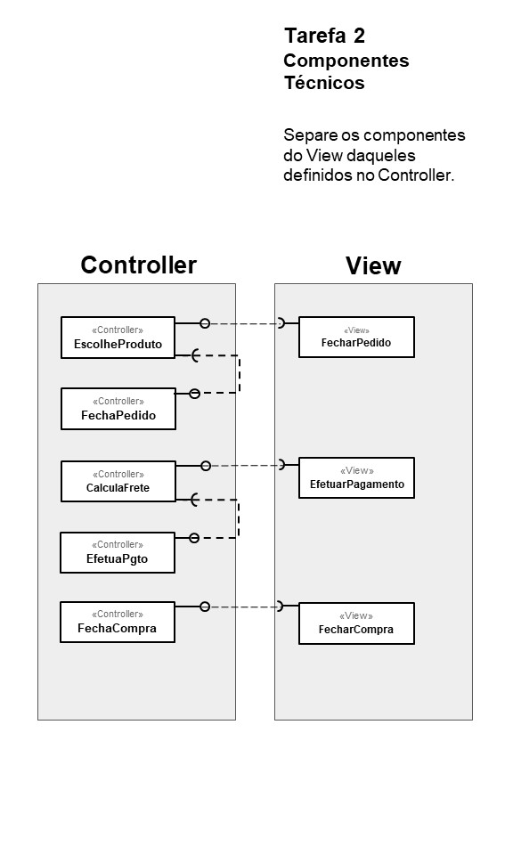
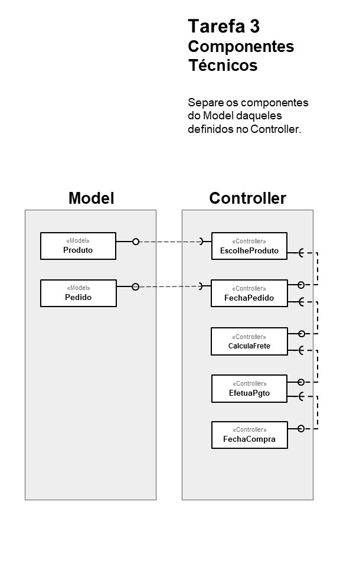

## Lab04 - MVC e Servicos REST
### Lab04 - MVC e Servicos REST, via API, a partir do site any.api 
Manoel Teixeira  
## Tarefa 1 - Componentes de Negocio

 

## Tarefa 2 - Componentes Técnicos (View, Controller)

 

## Tarefa 3 - Componentes Técnicos (Controller, Model)

 

## Tarefa 4

### Serviço `<Healthcare>`

* **Título do serviço**: `Healthcare`
* **Breve descrição**:
Existem diversos serviços a disposição, referente a cuidados com a saúde. No exemplo que peguei, temos a questão da pensão alimentícia, ou seja, é o dinheiro que você recebe de um cônjuge com quem você não mora mais, ou de um ex-cônjuge, se pago a você como parte de um acordo de divórcio, acordo de separação ou ordem judicial.
* **URL completa da requisição**: `https://any-api.com:8443/https://www.healthcare.gov/glossary/alimony.json`

* **Cabeçalho HTTP da chamada**:
~~~http
GET /https://www.healthcare.gov/glossary/alimony.json HTTP/2
Host: any-api.com:8443
User-Agent: Mozilla/5.0 (Windows NT 10.0; Win64; x64; rv:79.0) Gecko/20100101 Firefox/79.0
Accept: */*
Accept-Language: pt-BR,pt;q=0.8,en-US;q=0.5,en;q=0.3
Accept-Encoding: gzip, deflate, br
Origin: https://any-api.com
Connection: keep-alive
Referer: https://any-api.com/healthcare_gov/healthcare_gov/console/_glossary_pageName_mediaTypeExtension_/GET
~~~
* **Cabeçalho HTTP da resposta**:
~~~http
access-control-allow-origin: *
content-encoding: br
content-type: application/json
date: Fri, 28 Aug 2020 10:39:18 GMT
etag: W/"4cf2442d27399da5904c36139671b891:1502399854"
last-modified: Thu, 10 Aug 2017 20:14:25 GMT
strict-transport-security: max-age=31536000 ; preload
vary: Accept-Encoding
x-final-url: https://www.healthcare.gov/glossary/alimony.json
x-frame-options: SAMEORIGIN
x-permitted-cross-domain-policies: master-only
x-xss-protection: 1; mode=block
~~~
* **Conteúdo da resposta**:
~~~json
{
  "draft": false,
  "categories": [
    "glossary"
  ],
  "experience": "learn",
  "type": "glossary",
  "published": "true",
  "meta-title": "Alimony - HealthCare.gov Glossary",
  "meta-description": "Learn about alimony by reviewing the definition in the HealthCare.gov Glossary.",
  "title": "Alimony",
  "lang": "en",
  "layout": null,
  "tags": [
    "glossary"
  ],
  "page_name": "Alimony",
  "page_type": "glossary",
  "page_topic": "help",
  "page_lifecycle": "all",
  "page_audience": "all",
  "page_category": "glossary",
  "date": "2013-06-05 00:00:00 -0400",
  "slug": "alimony",
  "ext": ".md",
  "excerpt": "
Alimony is money you get from a spouse with whom you no longer live, or a former spouse, if paid to you as part of a divorce agreement, separation agreement, or court order. Payments designated in the agreement or order as child support or as a non-taxable property settlement aren’t alimony.
\n\n
For more information, see <a href=\"https://www.irs.gov/publications/p504/\">IRS Publication 504</a>.
\n",
  "url": "/glossary/alimony/",
  "content": "
Alimony is money you get from a spouse with whom you no longer live, or a former spouse, if paid to you as part of a divorce agreement, separation agreement, or court order. Payments designated in the agreement or order as child support or as a non-taxable property settlement aren’t alimony.
\n\n
For more information, see <a href=\"https://www.irs.gov/publications/p504/\">IRS Publication 504</a>.
\n",
  "sort": 0
}
~~~

