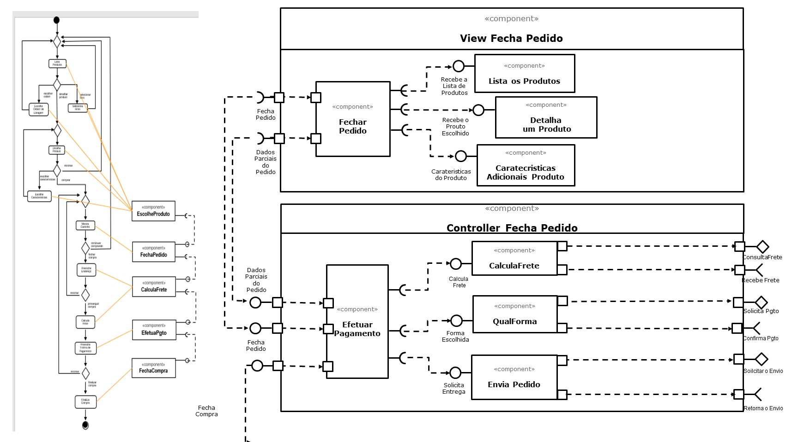

# Lab05 - WEB como Plataformas e Subcomponentes

## Tarefa 1
> Coloque a imagem do PNG do seu diagrama como ilustrado abaixo:
> 
> 
> 

## Tarefa 2
Link para o projeto no Codepen: [React 03 - Componente Barra](https://codepen.io/manoeltx01/pen/WNwXRge)
